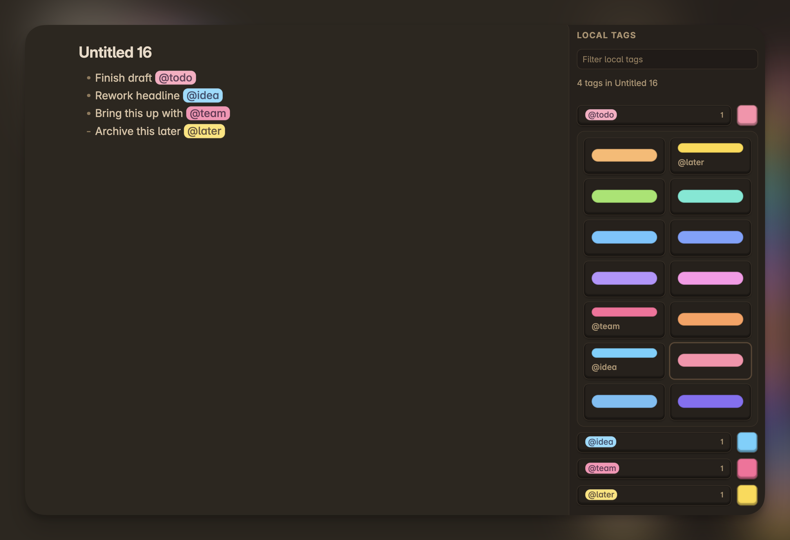
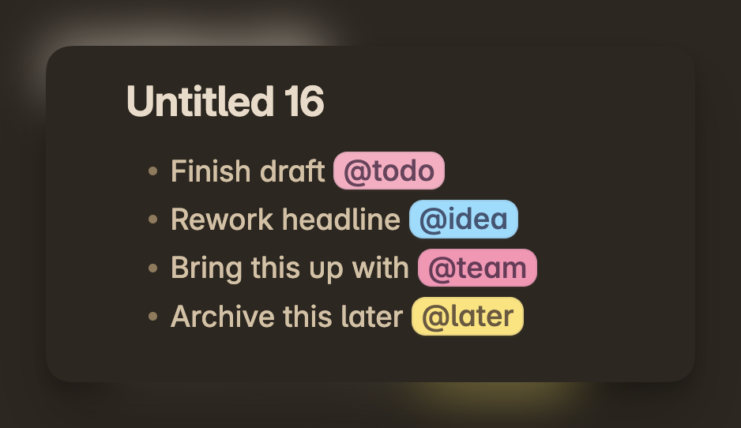
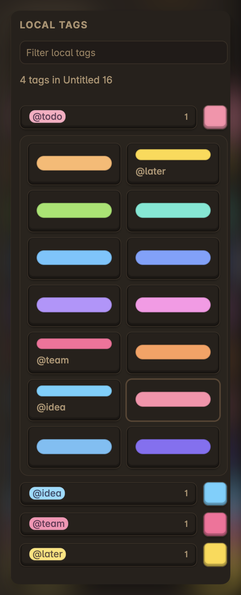

# Local tags

> This plugin was created with LLM assistance because I wanted this functionality for real use, fast. It is maintained in a practical, functionality-first way. If it is useful to you, feel free to use it, open issues, or send pull requests.

Local tags is an Obsidian plugin for inline file-scoped `@tags`.

It highlights `@tags` directly in your notes, assigns them distinct colors per file, and gives you a sidebar for browsing and finding them quickly inside the current note.



## Why this exists

Obsidian has native `#tags`, but sometimes you want lightweight inline markers that are local to a single note and do not become part of your global tag system.

This plugin is built for that workflow:

- use `@tags` inside one note
- keep them visually distinct
- browse them from a sidebar
- jump into Obsidian find for the selected tag

## At a glance

Highlight local tags directly in the editor and keep the current note's tags visible in a dedicated sidebar.



## Features

- Highlight inline local tags such as `@todo`, `@idea`, or `@team`
- Ignore `@...` inside inline code and fenced code blocks
- Assign stable colors to tags per file
- Browse all local tags in the current note from a sidebar
- Filter the tag list in the sidebar
- Open Obsidian's find UI for the selected tag in the current file
- Change tag colors from a palette in the sidebar
- Customize the color pool and visual styling in plugin settings

## How it works

`@tags` are treated as local note markers, not vault-wide metadata.

That means:

- colors are assigned within the current file
- the sidebar only shows tags from the active note
- changing a tag color affects that tag in that file only

Examples:

- `Discuss this with @team`
- `Need to revisit @todo`
- `Archive this later @later`

## Install

### Manual install

1. Download `main.js`, `manifest.json`, and `styles.css` from the latest release.
2. Create this folder inside your vault:

```text
<Vault>/.obsidian/plugins/local-tags/
```

3. Put the three files into that folder.
4. Open **Settings → Community plugins** in Obsidian.
5. Enable **Local tags**.

## Usage

1. Open any note.
2. Type inline tags such as `@todo` or `@scene-1`.
3. Open the command palette and run `Open local tag sidebar`.
4. Select a tag in the sidebar to find it in the current note.
5. Use the color button in the sidebar to choose a different color for that tag.



## Settings

The plugin currently lets you configure:

- whether highlighting is enabled
- tag border radius
- tag font weight
- the pool of colors available for local tags

## Development

Requirements:

- Node.js 18+
- npm

Development workflow:

```bash
npm install
npm run dev
```

Production build:

```bash
npm run build
```

Quality checks:

```bash
npm run lint
npm run check
```

The easiest local development setup is to place this repo directly in:

```text
<Vault>/.obsidian/plugins/local-tags/
```

Then run `npm run dev` and reload the plugin in Obsidian after changes.

## Releases

This repository is prepared for GitHub releases.

For a release:

1. Bump `version` in `manifest.json`
2. Update `versions.json`
3. Run `npm run check`
4. Create a GitHub release tag that exactly matches the plugin version
5. Attach `main.js`, `manifest.json`, and `styles.css`

Repository:

- GitHub: [levYatsishin/obsidian-local-tags](https://github.com/levYatsishin/obsidian-local-tags)
- Issues: [levYatsishin/obsidian-local-tags/issues](https://github.com/levYatsishin/obsidian-local-tags/issues)

## License

`0BSD`
